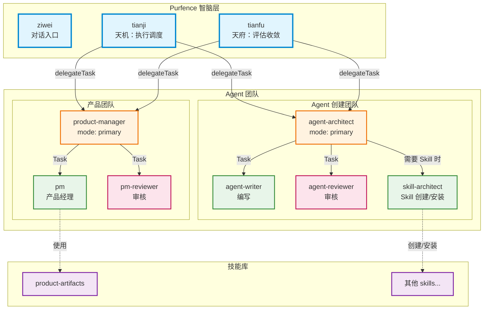
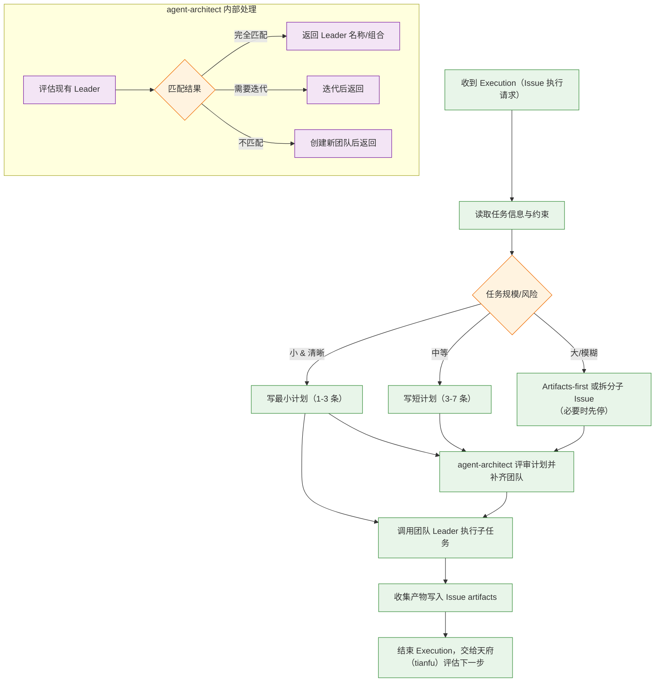
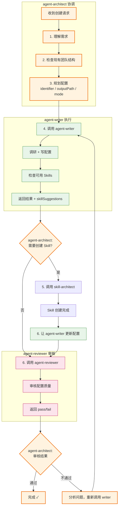
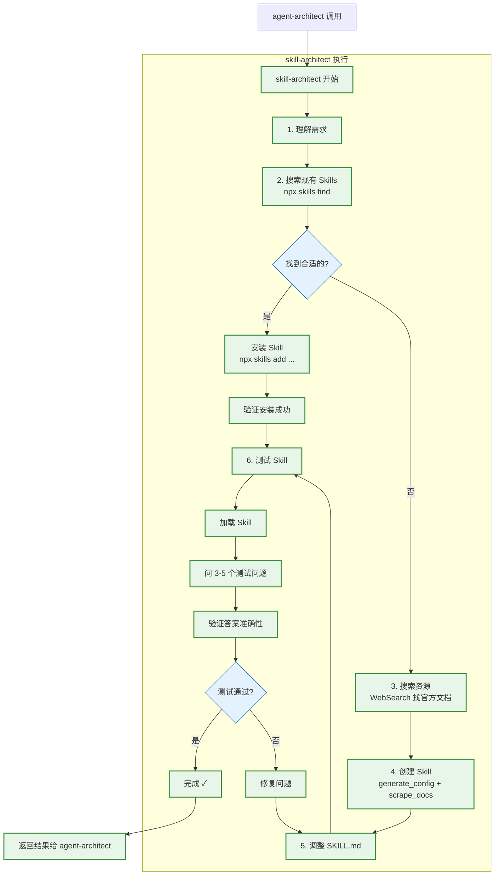

# Agent & Skill 架构

本文档描述 Purfence 智脑层（紫微/天机/天府）、Agent 团队、Skill 之间的关系和工作流程。

## 整体架构



## 团队结构

每个专业团队由三种角色组成：

| 角色         | 标识            | 职责                             |
| ------------ | --------------- | -------------------------------- |
| **Leader**   | `mode: primary` | 协调团队、分配任务、处理审核结果 |
| **Worker**   | 无 mode         | 执行具体工作                     |
| **Reviewer** | 无 mode         | 审核工作成果、提供反馈           |

### 命名原则

- **Leader**：名称反映功能（如 `product-manager`、`agent-architect`），用 `mode: primary` 标识
- **Worker**：`{domain}` 或 `{domain}-{role}`（如 `pm`、`dev-backend`）
- **Reviewer**：`{domain}-reviewer`（如 `pm-reviewer`、`agent-reviewer`）

## 工作流程

### 天机（tianji）调度流程



**关键点**：天机（tianji）只调度 **Leader**。
- 不直接指派 Worker/Reviewer。
- 天机先规划（按任务规模选择最轻但安全的流程），再调度。
- 对 **中等** 或 **大/模糊** 任务：建议把完整计划提交给 `agent-architect` 走 Plan Review Gate（它会在内部完成评估/迭代/创建，并返回可调度的 Leader 组合与修订建议）。
- 对 **小 & 清晰** 任务：当单团队可安全交付时可直接调度；否则也建议走 Plan Review Gate。

### Agent 创建流程（agent-architect 协调）



### Skill 创建流程（skill-architect 执行）

`skill-architect` 是 **agent 团队的成员**，由 `agent-architect` 调用。它是一个全能型 agent，自己完成所有工作（搜索、创建、测试）。



**为什么不用三层结构？**

由于 Claude Code 的递归防护设计，子 agent 不能再调用其他 agent。所以：

- `skill-architect` 必须是一个全能型 agent
- 它自己完成搜索、创建、测试的全部工作
- 由 `agent-architect` 直接调用

## 能力匹配

### Agent Description 规范

每个 Agent 的 description 必须包含：

```markdown
Capabilities: React, TypeScript, Tailwind CSS
Not for: Mobile development, Backend/API

Use when: Building web UI, frontend features
Don't use when: Native mobile apps, server-side logic
```

### agent-architect 的工作方式

调用方（通常是天机 `tianji`，或天府 `tianfu` 在评估阶段）建议采用以下正向工作方式：

1. **先规划**：先产出一个最小可执行的规划（目标、约束、拆分、你打算调度的 Leader 列表与顺序、预期产物）。
2. **走 Plan Review Gate**：对中等/大/模糊任务，或涉及多团队/能力缺口的情况，将“任务 + 完整计划”提交给 `agent-architect` 做校验与补全。
3. **按批准结果调度**：`agent-architect` 返回可调度的 Leader 名称/组合与修订建议（它会在内部完成评估/迭代/创建）。调用方据此更新计划并调度执行。

`agent-architect` 内部自动处理三种情况：

| 内部情况 | agent-architect 的处理    | 对外返回 |
| -------- | ------------------------- | -------- |
| 完全匹配 | 直接找到能做的            | Leader 名称/组合 + 修订建议 |
| 需要迭代 | 添加 skill / 更新提示词后 | Leader 名称/组合 + 修订建议 |
| 不匹配   | 创建新团队后              | Leader 名称/组合 + 修订建议 |

**调用方不需要关心这些内部状态**，只需要按返回的“Leader 组合 + 修订建议”更新自己的计划，然后调度执行。

### 迭代 vs 新团队的判断（agent-architect 内部）

| 场景                       | 判断       | 理由                   |
| -------------------------- | ---------- | ---------------------- |
| Web 前端 + React 19 新特性 | **迭代**   | 同领域，版本更新       |
| Web 前端 + 动画/交互设计   | **迭代**   | 同领域，能力扩展       |
| Web 前端 → iOS 开发        | **新团队** | 不同平台和技术栈       |
| Web PM → iOS PM            | **新团队** | 不同平台，设计语言不同 |

**关键原则**：迭代是**同领域的小幅度增强**，核心职责不变；如果需要完全不同的专业能力，应创建新团队。

## 文件结构

```
# 项目内（实际存放位置）
backend/src/purfence/agents/
├── ziwei.md                  # 紫微 - 对话助手（项目/需求管理）
├── tianji.md                 # 天机 - Issue 执行者
├── tianfu.md                 # 天府 - Execution 评估器
├── product-manager.md        # PM 团队 Leader
├── pm.md                     # PM Worker
├── pm-reviewer.md            # PM Reviewer
├── agent-architect.md        # Agent 团队 Leader
├── agent-writer.md           # Agent Writer
├── agent-reviewer.md         # Agent Reviewer
├── skill-architect.md          # Skill 创建（Agent 团队成员）
├── tester.md                 # 测试专家
└── critic.md                 # 通用评审专家

# Claude Code 配置目录（软链接）
~/.claude/agents/
└── purfence -> /path/to/purfence/backend/src/purfence/agents

# Skill 库
~/.claude/skills/
└── product-artifacts/        # 产品工件 Skill
    ├── SKILL.md
    └── references/
        ├── prd.md
        ├── ia.md
        ├── acceptance.md
        ├── open_questions.md
        └── inputs.md
```

### 软链接设置

Agents 实际文件存放在项目目录内 (`backend/src/purfence/agents/`)，通过软链接让 Claude Code 能够加载：

```bash
# 创建软链接（项目初始化时执行）
ln -sf /path/to/purfence/backend/src/purfence/agents ~/.claude/agents/purfence
```

这种设计的好处：

- **版本管理**：Agent 配置随项目代码一起版本控制
- **团队协作**：所有成员使用相同的 Agent 配置
- **易于维护**：在 IDE 中编辑 Agent 文件，Claude Code 自动生效

## 关键设计

### 1. 团队模式

- 每个专业领域由 Leader + Worker + Reviewer 组成
- Leader 协调，Worker 执行，Reviewer 审核
- 确保输出质量

### 2. 能力边界

- 每个 Agent 明确声明能力范围
- 避免任务分配错误
- 需要时创建新团队

### 3. Skill 复用

- 知识封装为 Skill
- Agent 按需加载
- 避免重复学习

### 4. 层级调度

```
Purfence 智脑层（紫微/天机/天府）
    ↓
Team Leader（团队协调）
    ↓
Worker + Reviewer（执行 + 审核）
```

## 扩展新团队

当需要新的专业能力时：

1. 让 `agent-architect` 评估现有团队
2. 如果无法满足，创建新团队：
   - 先创建 Worker
   - 再创建 Reviewer（复制 Worker 的专业知识）
   - 最后创建 Leader
3. 如果需要 Skill，`agent-architect` 会调用 `skill-architect` 来查找或创建
