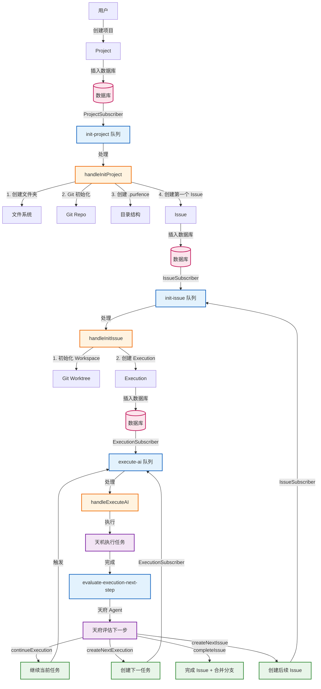

# 智能任务处理流程

## 流程图



## 队列任务清单

| 队列任务 | 触发方式 | 处理内容 |
|---------|---------|---------|
| `init-project` | ProjectSubscriber | 创建文件夹、Git 初始化、创建 Issue |
| `init-issue` | IssueSubscriber | 初始化 Workspace、创建 Execution |
| `execute-ai` | ExecutionSubscriber | 执行 AI 任务 |
| `evaluate-execution-next-step` | execute-ai 完成后 | 天府 Agent 评估下一步 |

## 天府 Agent 工具

| 工具 | 作用 |
|-----|-----|
| `continueExecution` | 继续当前执行（更新 goal 后重新执行） |
| `createNextExecution` | 创建下一执行（当前阶段完成，开始新阶段） |
| `completeIssue` | 完成 Issue（自动合并分支到 main） |
| `createNextIssue` | 创建后续 Issue（继续推进项目） |

## 事件驱动架构

```
Project 创建 → ProjectSubscriber → init-project
  ↓
Issue 创建 → IssueSubscriber → init-issue
  ↓
Execution 创建 → ExecutionSubscriber → execute-ai
  ↓
任务完成 → evaluate-execution-next-step
  ↓
天府 Agent 自主决策：
  - 继续 Execution / 新建 Execution → 循环执行
  - 完成 Issue → 合并分支
  - 创建新 Issue → 循环到 Issue 初始化
```

## 详细流程说明

### 第一阶段：项目初始化

1. **用户创建 Project** → 数据库插入
2. **ProjectSubscriber.afterInsert()** → 触发 `init-project`
3. **handleInitProject()**：
   - 创建 `repo/`、`worktrees/`、`attachments/` 目录
   - Git 初始化（`git init -b main`）
   - 创建 `.purfence` 目录结构
   - 创建第一个 Issue（内容 = Project 需求）

### 第二阶段：Issue 初始化

4. **IssueSubscriber.afterInsert()** → 触发 `init-issue`
5. **handleInitIssue()**：
   - 创建 Git Worktree（分支）
   - 写入 `issue.json` 和 `idea.md`
   - 创建 Execution 记录

### 第三阶段：任务执行

6. **ExecutionSubscriber.afterInsert()** → 触发 `execute-ai`
7. **handleExecuteAI()**：
    - 加载 tianji（天机）prompt
    - 调用 AI 执行任务
    - 完成后触发 `evaluate-execution-next-step`

### 第四阶段：评估与决策（天府 Agent）

8. **handleEvaluateExecutionNextStep()**：
    - 加载 tianfu prompt
    - 创建天府 Agent（带工具）
   - Agent 自主决策调用哪个工具

**天府 Agent 决策流程：**

```
Execution 完成
  ↓
Issue 目标是否达成？
  ├─ 否 → 需要继续吗？
  │       ├─ 是，小任务 → continueExecution
  │       └─ 是，新阶段 → createNextExecution
  └─ 是 → completeIssue（合并分支）
          ↓
       项目还有其他功能吗？
          ├─ 是 → createNextIssue
          └─ 否 → 结束（项目完成）
```

## 关键设计

### 事件驱动
- 所有实体创建后通过 Subscriber 触发后续流程
- 解耦各阶段逻辑

### Agent + 工具模式
- 评估逻辑由天府 Agent 自主决策
- 通过工具实现具体操作
- 代码简洁，易于扩展

### Issue 完成 = 合并分支
- 每个 Issue 有独立分支
- Issue 完成时自动合并到 main
- 不需要等整个项目完成

### Issue 依赖
- Issue 实体支持 `dependsOnIssueId` 字段
- 后续可实现依赖调度逻辑

## 代码文件

### Subscribers
- `purfence-project.subscriber.ts` - Project 创建事件
- `purfence-issue.subscriber.ts` - Issue 创建事件
- `purfence-execution.subscriber.ts` - Execution 创建事件

### Services
- `purfence-execution.service.ts` - Execution 业务逻辑
- `purfence-issue.service.ts` - Issue 业务逻辑
- `purfence-project.service.ts` - Project 业务逻辑

### Event Listener
- `purfence-event-listener.service.ts` - 事件处理（替代旧 BullMQ processor）

### Tools
- `tools/tianfu.tools.ts` - 天府 Agent 专用工具
- `tools/purfence.tools.ts` - 通用 Purfence 工具

### Agents
- `agents/ziwei.md` - 紫微：对话助手，项目/需求管理
- `agents/tianji.md` - 天机：Issue 执行者
- `agents/tianfu.md` - 天府 Agent prompt

## 合并分支流程

当天府 Agent 调用 `completeIssue` 时：

```
1. 在 issue worktree 中执行 git merge main
   ├─ 成功 → 继续步骤 2
   └─ 冲突 → 返回错误，Agent 用 delegateTask 解决后重试

2. 切换到 repo/main，执行 git merge issue/xxx（无冲突）

3. 更新 Issue 状态为 done
```

**冲突处理**：冲突在 issue worktree 中解决，不污染 main 分支。

## delegateTask 工具

天府 Agent 可以使用 `delegateTask` 启动子 Agent：

| 场景 | 用途 |
|-----|-----|
| 代码分析 | 无法从上下文判断 Issue 是否完成时，深入分析代码 |
| 解决冲突 | 合并分支冲突时，启动子 Agent 解决 |

子 Agent 自动在当前 Issue 的 workdir 中工作，无需传递路径。
